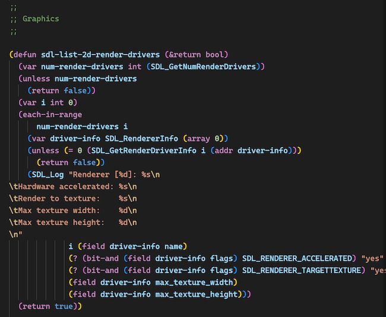

# Cakelisp language support for Visual Studio Code (Unofficial)

[](https://marketplace.visualstudio.com/items?itemName=funatsu-fumiya.vscode-cakelisp)

Unofficial syntax highlighting support for [Cakelisp](https://macoy.me/code/macoy/cakelisp) in Visual Studio Code.

## Screenshots



## Features

- Syntax highlighting

## Install from Marketplace

https://marketplace.visualstudio.com/items?itemName=funatsu-fumiya.vscode-cakelisp [](https://marketplace.visualstudio.com/items?itemName=funatsu-fumiya.vscode-cakelisp)

## Local install
```bash
# First, make sure you have Node.js version 14 or greater installed. 

# Clone the extension.
$ git clone https://github.com/funatsufumiya/vscode-cakelisp.git
$ cd vscode-cakelisp

# Install vscode-cakelisp dependencies.
$ npm install

# Generate the vscode extension (VSIX) file using vsce. 
$ npx vsce package

# Install the extension.
$ code --install-extension vscode-cakelisp-0.0.1.vsix

# Finally reload the vscode window (cmd + shift + P > Developer: Reload Window).
```

Alternatively you can clone the extension right into vscode's extention directory. This is easier, but can be unreliable as vscode will sometimes clean up the extension directory and remove vscode-cakelisp.

```bash
# Clone the extension.
$ cd ~/.vscode/extensions
$ git clone https://github.com/funatsufumiya/vscode-cakelisp.git

# Force vscode to regenerate the extensions.json file.
$ mv extensions.json /tmp/ 

# Finally reload the vscode window (cmd + shift + P > Developer: Reload Window).

# If you're finding that vscode isn't loading the extension, you can force it to
# regenerate the extensions.json file by removing ~/.vscode/extensions/extensions.json.
```


## Debug this extension

- Run `npm install` in terminal to install dependencies
- Run the `Run Extension` target in the Debug View in VS Code. This will:
	- Start a task `npm: watch` to compile the code
	- Run the extension in a new VS Code window
